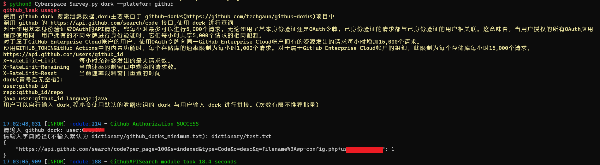

# Cyberspace Survey


**结合网络空间测绘和 OSINT 的技巧，帮助蓝队溯源反制。**

## 使用帮助

对应API接口申请可参考: config/api.py
 
```java
dork 模块
python3 Cyberspace_Survey.py dork --plateform google --output google.txt
python3 Cyberspace_Survey.py dork --plateform fofa --output fofa.txt
python3 Cyberspace_Survey.py dork --plateform shodan --output shodan.txt
python3 Cyberspace_Survey.py dork --plateform github --output github.txt

personal 模块
python3 Cyberspace_Survey.py personal --plateform hunter_search --target bytedance.com --output hunter.txt
python3 Cyberspace_Survey.py personal --plateform hunter_verify --target xx@bytedance.com --output hunter.txt
python3 Cyberspace_Survey.py personal --plateform download_find  --target 111.111.111.111--output download.txt
python3 Cyberspace_Survey.py personal --plateform github_email --target github_id --output github_email.txt

ti 模块
python3 Cyberspace_Survey.py ti --plateform inquest --target ['xred.mooo.com','f481819cc864d272b4a2dc7eed506adc'] --output inquest.txt
python3 Cyberspace_Survey.py ti --plateform otx --target ['xred.mooo.com','f481819cc864d272b4a2dc7eed506adc'] --output otx.txt

leak 模块
python3 Cyberspace_Survey.py leak --plateform internet_endpoint --target baidu.com --output endpoint.txt
python3 Cyberspace_Survey.py leak --plateform google_leak --target baidu.com --output google_leak.txt

tools 模块
python3 Cyberspace_Survey.py tools --plateform ico --target https://www.baidu.com/favicon.ico --output ico.txt
python3 Cyberspace_Survey.py tools --plateform cert --target baidu.com --output cert.txt
python3 Cyberspace_Survey.py tools --plateform exif --target 1.jpg --output cert.txt
python3 Cyberspace_Survey.py tools --plateform file --target hex_data.bin --output hex.txt
python3 Cyberspace_Survey.py tools --plateform str2hex --target 1.1.1.1 --output str2hex.txt

可以使用 targets 传入文件(默认 target 目录下)，文件内容为对应模块所需要的格式
```

## **主要功能**

### **1.资产收集(dork)**

使用 github/shodan/google/fofa dork 搜索特定网站如(产品、组件、操作系统、端口、网段、证书、ico、子域名、蜜罐，部分搜索语法可以参考附录中的网络空间测绘)

- github dork

    

    python3 Cyberspace_Survey.py dork --plateform github

- fofa

    

    python3 Cyberspace_Survey.py dork --plateform fofa --output fofa.txt

- shodan

    

    python3 Cyberspace_Survey.py dork --plateform shodan --output shodan.txt

- google

    

    python3 Cyberspace_Survey.py dork --plateform google --output google.txt

### **2.个人信息(personal)**

- 收集公司的邮箱信息(hunter)

    

    python3 Cyberspace_Survey.py personal --target bytedance.com --plateform hunter_search

- 验证邮箱是否存在，标出泄露邮箱的来源

    

    python3 Cyberspace_Survey.py personal --target xxx@bytedance.com --plateform hunter_verify

- 收集 IP 所下载的种子文件

    

    python3 Cyberspace_Survey.py personal --target 103.138.74.69 --plateform download_find --output download.txt

- 通过 github api 接口找到 github 的邮箱(邮箱源于作者最近的commit和仓库活动)

    

    python3 Cyberspace_Survey.py personal --target ** --plateform github_email

### 3**.信息泄露(leak)**

- 通过 google 搜索引擎搜索(db/phpinfo/phpadmin/sqlerror/config/bak/rsa/password.txt、目录遍历漏洞、.git/.svn/.ds_store、泄露的用户凭证等)

    

    python3 Cyberspace_Survey.py leak --plateform google_leak --target freebuf.com --output google_leak.txt

- 调用接口(github endpoint 、web.archive.org 查找寻找到废弃的 js、commoncrawl 查找Endpoint)丰富数据

    

    python3 Cyberspace_Survey.py leak --plateform internet_endpoint --target [t00ls.net](http://t00ls.net/) --output endpoint.txt

- ~~broken link(todo)~~

### 4**.威胁情报(ti)**

- inquest

    

    python3 Cyberspace_Survey.py ti --plateform inquest --target f590e1b6a80cf3e8360388382eabb04b3e247b78

- Open Threat Exchange

    

    python3 Cyberspace_Survey.py ti --plateform otx --target 'f590e1b6a80cf3e8360388382eabb04b3e247b78','211.94.162.245','srtuoiiuhg.work'


### 5**.工具栏**

- ico 转换 hash,方便使用 fofa shodan等进行搜索

    

- 拉取网站的证书信息

    

- 提取图片中的 exif 信息

    

- file

    


- 字符串16进制相互转换

    

    

## **注意事项**

1. 我本地环境默认全局代理(也可以在 setting.py 将代理改为 http://127.0.0.1:7890)。
2. github 接口(github_email、github_api、endpoint_search)请求频繁容易被限制，endpoint_search 函数搜索互联网上泄露的 endpoint，最好选择小众一些的(t00ls.net)，如果选择类似 baidu.com，endpoint_search 的 github 接口请求次数会频繁
3. dns、ip 模块使用的是内网接口，故公开版删除。

## **免责声明**

依据中华人民共和国网络安全法第二十七条：任何个人和组织不得从事非法侵入他人网络、干扰他人网络正常功能、窃取网络数据等危害网络安全的活动；不得提供专门用于侵入网络、干扰网络正常功能及防护措施、窃取网络数据等危害网络安全活动的程序、工具；明知他人从事危害网络安全的活动的不得为其提供技术支持、广告推广、支付结算等帮助。

使用本工具则默认遵守网络安全法

原文：[Cyberspace_Survey](https://www.notion.so/Cyberspace-Survey-fdeb7cc3288d4d1fb4bc6caae1b4b06f)

**Thanks:**

[OneForAll - 一款功能强大的子域收集工具](https://github.com/shmilylty/OneForAll)

[OTX-Python-SDK - Open Threat Exchange](https://github.com/AlienVault-OTX/OTX-Python-SDK)

[AlienVault-OTX](https://github.com/AlienVault-OTX/ApiV2)

[奇安信 - 威胁情报中心](https://ti.qianxin.com/)

[github-endpoints](https://github.com/gwen001/github-endpoints)

[github-search](https://github.com/gwen001/github-search)

[github-dorks](https://github.com/techgaun/github-dorks)

[https://github.com/random-robbie/keywords/blob/master/keywords.txt](https://github.com/random-robbie/keywords/blob/master/keywords.txt)

[awesome-threat-intelligence](https://github.com/hslatman/awesome-threat-intelligence)

**Reference:**

[[PRE] 资产搜索引擎](https://www.notion.so/PRE-3255b1c7c50d4244b50f3a199d22b97a)

[[PRE] Information Collection For Pentest](https://www.notion.so/PRE-Information-Collection-For-Pentest-a20a07b7294847bb880265bad9d67e6c)

[Digital-Privacy - 一个关于数字隐私搜集、保护、清理集一体的方案,外加开源信息收集(OSINT)对抗](https://github.com/ffffffff0x/Digital-Privacy)

[信息收集](https://wh0ale.github.io/2019/08/27/%E4%BF%A1%E6%81%AF%E6%94%B6%E9%9B%86/)

[awesome-shodan-queries](https://github.com/jakejarvis/awesome-shodan-queries)

[https://developer.shodan.io/api](https://developer.shodan.io/api)
